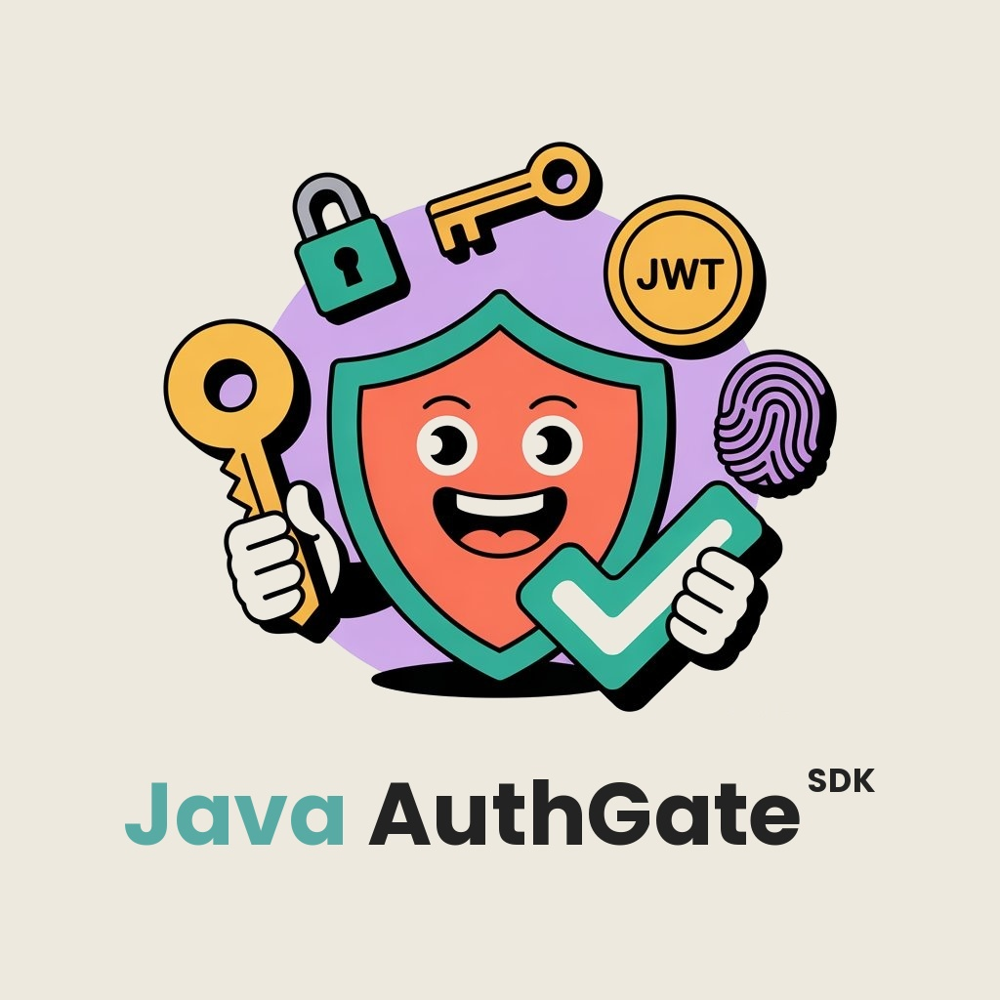

<div align="center">

# Java AuthGate SDK



**Провайдер-независимая OIDC-библиотека для Java 21+**

Валидация JWT и получение сервисных токенов через client-credentials — без привязки к фреймворку.

[](https://github.com/homni-labs/authgate-sdk-java/releases)
[](https://github.com/homni-labs/authgate-sdk-java/actions/workflows/ci.yml)
[](https://javadoc.io/doc/io.github.homni-labs/authgate-sdk-java)
[](#)
[](LICENSE)

[English](README.md) | [Русский](README_RU.md)

</div>

---

## Подключение

**Maven** (из [Maven Central](https://central.sonatype.com/artifact/io.authgate/authgate-sdk-java)):

```xml
<dependency>
    <groupId>io.github.homni-labs</groupId>
    <artifactId>authgate-sdk-java</artifactId>
    <version>0.0.1-alpha.1</version>
</dependency>
```

**Gradle (Kotlin DSL):**

```kotlin
implementation("io.github.homni-labs:authgate-sdk-java:0.0.1-alpha.1")
```

**Gradle (Groovy DSL):**

```groovy
implementation 'io.github.homni-labs:authgate-sdk-java:0.0.1-alpha.1'
```

## Конфигурация

| Параметр | Обязательный | По умолчанию | Описание |
|---|---|---|---|
| `issuerUri` | **да** | — | Базовый URL OIDC-провайдера |
| `clientId` | **да** | — | OAuth 2.1 идентификатор клиента |
| `clientSecret` | нет | `null` | Секрет клиента для client-credentials grant |
| `audience` | нет | `null` | Ожидаемый `aud` claim. Если задан — токены без него отклоняются |
| `requireHttps` | нет | `true` | Отклонять `issuerUri` без HTTPS |
| `httpTimeout` | нет | `10s` | Таймаут HTTP-вызовов к IdP |
| `discoveryTtl` | нет | `1h` | TTL кэша OIDC discovery документа |
| `clockSkewTolerance` | нет | `30s` | Допустимое расхождение часов при проверке `exp` |
| `circuitBreakerFailureThreshold` | нет | `5` | Число ошибок до размыкания circuit breaker |
| `circuitBreakerResetTimeout` | нет | `30s` | Время до пробного вызова после размыкания |
| `serviceTokenCacheSize` | нет | `64` | Макс. количество кэшированных сервисных токенов |

## Использование

### Инициализация

```java
var config = new AuthGateConfiguration.Builder()
        .issuerUri("https://idp.example.com/realms/my-realm/")
        .clientId("my-client")
        .clientSecret("secret")
        .build();

var sdk = AuthGate.builder(config).build();
```

Кастомная инфраструктура:

```java
var sdk = AuthGate.builder(config)
        .cacheStore(redisCacheStore)
        .httpTransport(customTransport)
        .build();
```

### Авторизация

`authorize()` валидирует токен и возвращает fluent chain. Два стиля:

**Через исключения** — `TokenValidationException` (401) / `AccessDeniedException` (403):

```java
sdk.authorizeFromHeader(authHeader).orThrow();
sdk.authorizeFromHeader(authHeader).scope(new OAuthScope("email")).orThrow();
sdk.authorizeFromHeader(authHeader).scope(new OAuthScope("email")).subject(userId).orThrow();
```

**Полиморфный** — `AuthorizationResult` sealed interface:

```java
switch (sdk.authorizeFromHeader(authHeader).scope(new OAuthScope("profile")).evaluate()) {
    case AuthorizationResult.Granted g  -> handle(g.token());
    case AuthorizationResult.Denied d   -> log.warn(d.reason());
    case AuthorizationResult.Rejected r -> log.warn(r.reason().description());
}
```

<details>
<summary><b>Коды отказа</b></summary>

| Код | Описание |
|---|---|
| `TOKEN_EXPIRED` | Токен просрочен |
| `INVALID_SIGNATURE` | Подпись не прошла верификацию |
| `ISSUER_MISMATCH` | Issuer не совпадает |
| `AUDIENCE_MISMATCH` | Audience не совпадает |
| `MALFORMED_TOKEN` | Невалидная структура JWT |
| `UNKNOWN` | Непредвиденная ошибка |

</details>

### Client Credentials

Получение сервисных токенов для межсервисного взаимодействия. Токены кэшируются по набору scopes и обновляются автоматически.

```java
ServiceToken token = sdk.acquireServiceToken(Set.of(new OAuthScope("openid"), new OAuthScope("profile")));
httpClient.header("Authorization", "Bearer " + token.accessToken());
```

Требует `clientSecret` в конфигурации.

### Кастомный CacheStore

По умолчанию — in-memory `ConcurrentHashMap`. Для multi-instance деплоев реализуйте `CacheStore`:

```java
var sdk = AuthGate.builder(config)
        .cacheStore(redisCacheStore)
        .build();
```

## Зависимости

| Библиотека | Назначение |
|---|---|
| `nimbus-jose-jwt` | Валидация JWT, JWKS |
| `jackson-databind` | Парсинг JSON |
| `slf4j-api` | Фасад логирования |

**Требования:** Java 21+

## Roadmap

| Статус | Фича | Issue |
|--------|-------|-------|
| 🔲 | Token Exchange (RFC 8693) — делегирование и имперсонация | [issue](https://github.com/homni-app/authgate-sdk-java/issues/1) |
| 🔲 | Token Refresh — автоматическое обновление access-токенов через refresh-токены | [issue](https://github.com/homni-app/authgate-sdk-java/issues/2) |
| 🔲 | UserInfo-эндпоинт — получение данных пользователя без лишних запросов к IdP | [issue](https://github.com/homni-app/authgate-sdk-java/issues/3) |
| 🔲 | Отказ от геттеров в пользу модификаторов доступа | [issue](https://github.com/homni-app/authgate-sdk-java/issues/4) |
| 🔲 | Оптимизация артефакта — снижение размера SDK | [issue](https://github.com/homni-app/authgate-sdk-java/issues/5) |
| ✅ | Публикация в Maven Central | [issue](https://github.com/homni-app/authgate-sdk-java/issues/6) |
| ✅ | Поддержка Gradle | [issue](https://github.com/homni-app/authgate-sdk-java/issues/7) |
| ✅ | CI pipeline — прогон тестов на push/PR | [issue](https://github.com/homni-labs/authgate-sdk-java/issues/9) |

## Contributing

1. Форкните репозиторий
2. Создайте ветку от `master` (`feature/...`, `fix/...`, `refactor/...`)
3. Напишите код и тесты
4. `mvn clean install`
5. Откройте Pull Request — один фикс или фича на PR, привяжите issue (`Closes #1`)

> **Стиль кода** — следуйте существующим конвенциям, пишите тесты на каждую новую фичу, покрывайте edge cases.

### Вопросы?

| Канал | Ссылка |
|-------|--------|
| GitHub Discussions | [discussions](https://github.com/homni-app/authgate-sdk-java/discussions) |
| Telegram | [@zaytsev_dv](https://t.me/zaytsev_dv) |
| Email | zaytsev.dmitry9228@gmail.com |

## Лицензия

Проект распространяется под лицензией [MIT](LICENSE).

